# PRODIGY_DS_03 - Decision Tree Classifier for Customer Purchase Prediction

## 📌 Task Overview

This project was completed as part of the **Prodigy InfoTech Data Science Internship – Task 03**.

The objective is to build a **Decision Tree Classifier** that predicts whether a customer will subscribe to a term deposit based on demographic and behavioral data using the **Bank Marketing Dataset**.

---

## 📂 Dataset

- **Dataset:** Bank Marketing Dataset
- **Source:** UCI Machine Learning Repository
- **File Used:** `bank-full.csv`
- **Total Records:** 45,211
- **Features:** 16 Input Features + 1 Target Variable

**Target Variable**

- **y**
  - `Yes` → Customer subscribed to the term deposit.
  - `No` → Customer did not subscribe.

---

## 🎯 Project Objective

Develop a Decision Tree Classification model capable of predicting customer subscription outcomes based on demographic information, financial attributes, and previous marketing campaign interactions.

---

## 🛠️ Technologies Used

- Python
- Google Colab
- Pandas
- NumPy
- Matplotlib
- Seaborn
- Scikit-learn

---

## 📊 Project Workflow

- Import required libraries
- Load and inspect the dataset
- Perform Exploratory Data Analysis (EDA)
- Check for missing and unknown values
- Encode categorical features using LabelEncoder
- Split the dataset into training and testing sets
- Train a Decision Tree Classifier
- Evaluate model performance
- Visualize the Decision Tree
- Analyze feature importance

---

## 📈 Exploratory Data Analysis

The following visualizations were created to better understand the dataset:

### Target Variable Distribution

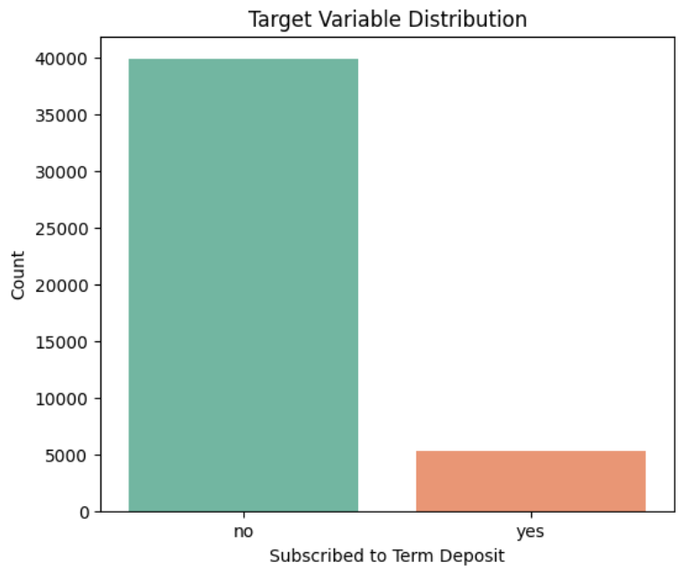

### Age Distribution

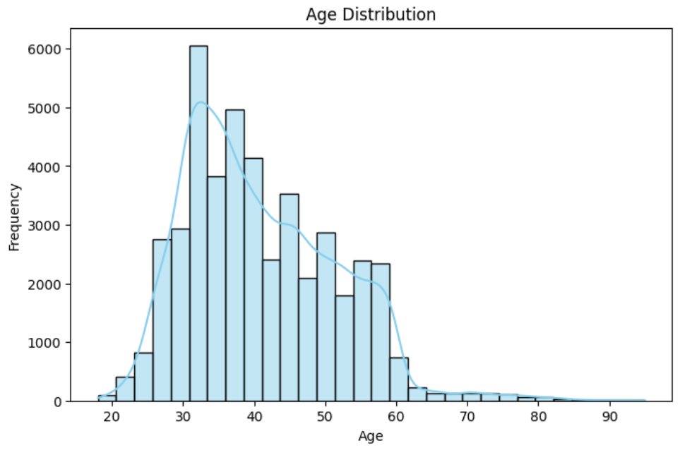

### Job Distribution

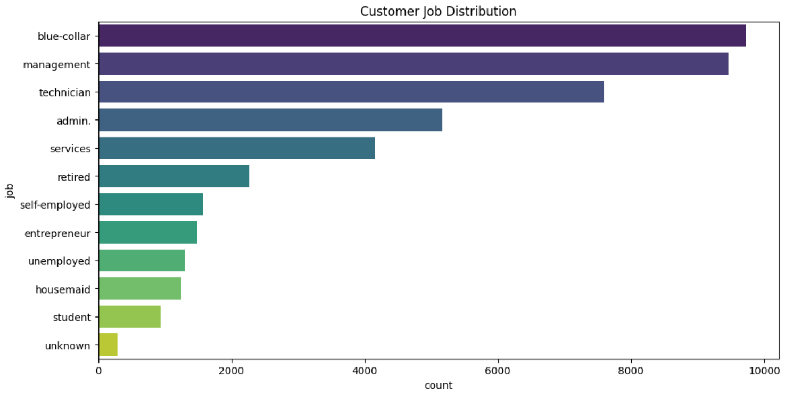

### Marital Status Distribution


### Education Distribution

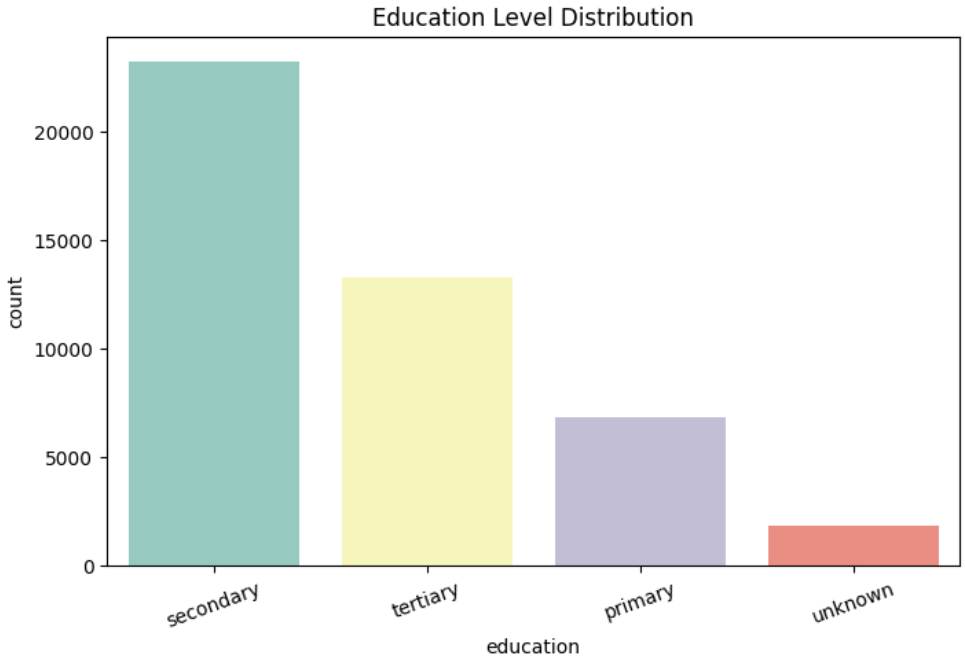

### Housing Loan Distribution

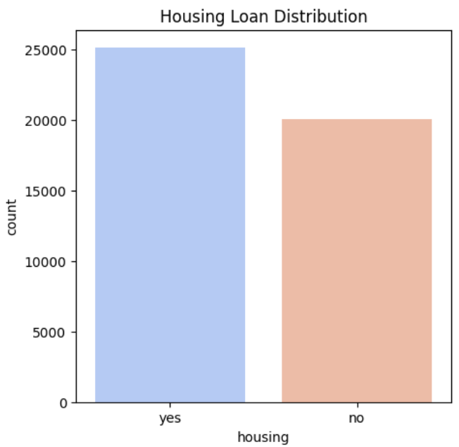

### Personal Loan Distribution

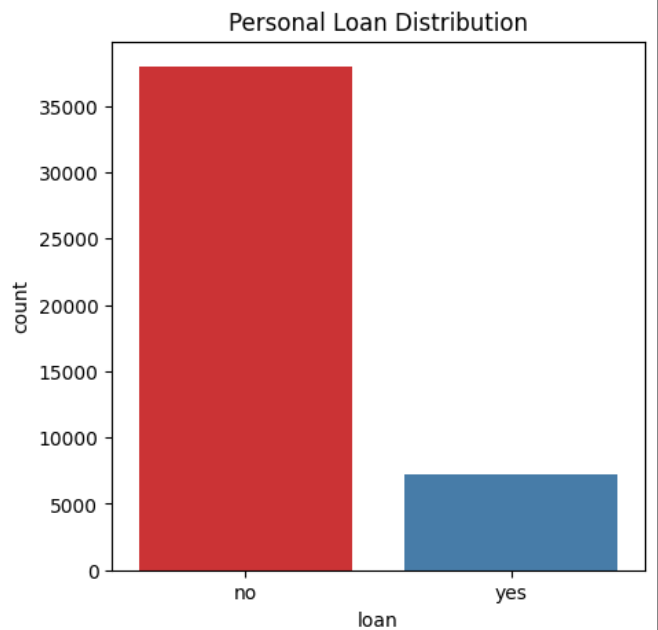

### Correlation Heatmap

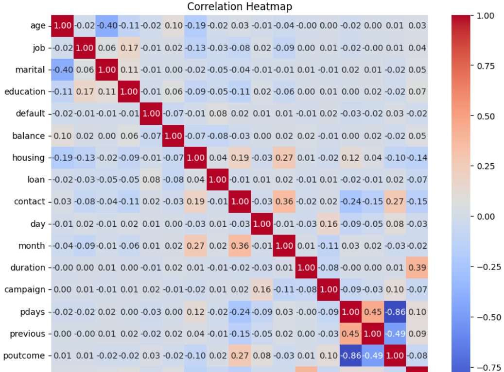

### Subscription by Job

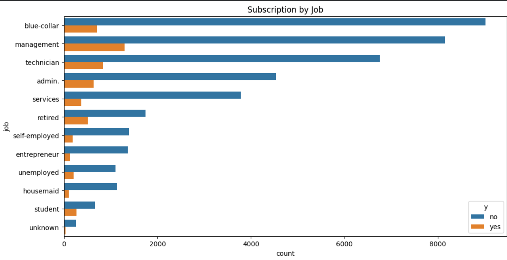

### Subscription by Education

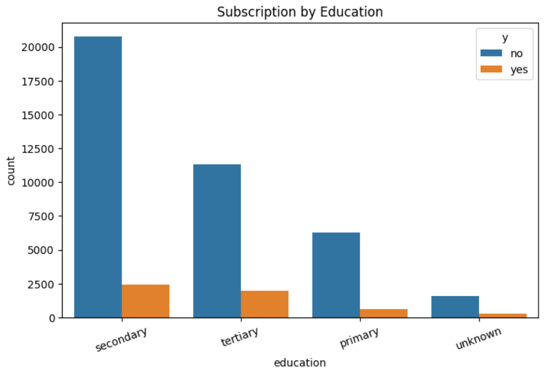

---

## 🤖 Model Building

A **Decision Tree Classifier** was trained using the processed dataset after encoding all categorical variables.

### Data Split

- Training Data: 80%
- Testing Data: 20%

---

## 📊 Model Performance

### Accuracy

**89.35%**

### Classification Report

| Class | Precision | Recall | F1-Score |
|--------|----------:|--------:|---------:|
| No | 0.92 | 0.96 | 0.94 |
| Yes | 0.59 | 0.40 | 0.48 |

The model performs exceptionally well in identifying customers who did not subscribe. Performance for the "Yes" class is comparatively lower due to the imbalanced nature of the dataset.

---

## 📉 Confusion Matrix

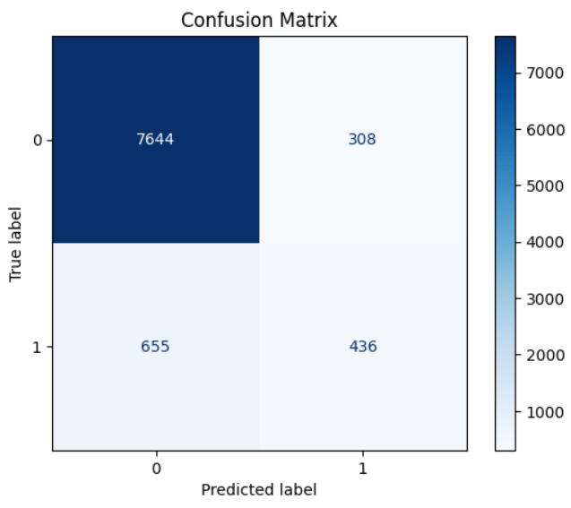

---

## 🌳 Decision Tree Visualization

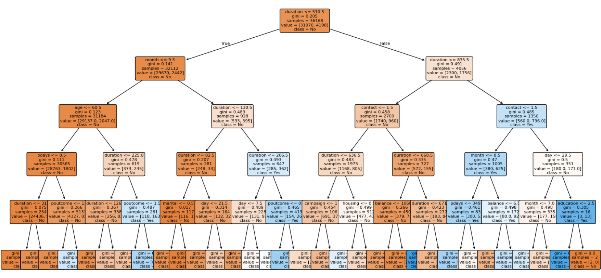

---

## ⭐ Feature Importance

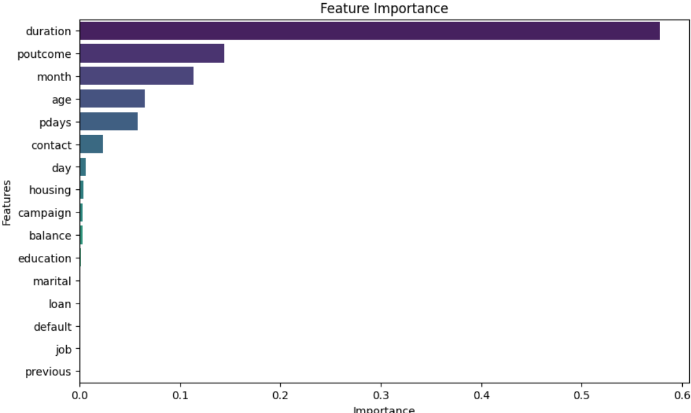

The most influential features identified by the Decision Tree model are:

- Duration
- Previous Campaign Outcome (poutcome)
- Month
- Age
- Days Since Previous Contact (pdays)

These features contribute the most toward predicting customer subscription behavior.

---

## 💡 Key Insights

- The Decision Tree Classifier achieved an overall accuracy of **89.35%**.
- The dataset is imbalanced, with significantly more "No" responses than "Yes" responses.
- The model performs very well in predicting customers who did not subscribe.
- Duration is the most influential feature affecting customer subscription prediction.
- Decision Trees provide interpretable decision rules, making them useful for understanding customer behavior.

---

## 📁 Repository Structure

```
PRODIGY_DS_03_Decision_Tree_Classifier/
│
├── images/
│   ├── age_distribution.png
│   ├── confusion_matrix.png
│   ├── correlation_heatmap.png 
│   ├── customer_job_distribution.png marital_distribution.png
│   ├── decision_tree.png 
│   ├── education_level_distribution.png housing_loan_distribution.png
│   ├── feature_importance.png personal_loan_distribution.png
│   ├── housing_loan_distribution.png
│   ├── marital_distribution.png
│   ├── personal_loan_distribution.png 
│   ├── subscription_by_education.png
│   ├── subscription_by_job.png
│   └── target_variable_distribution.png
│
├── bank-full.csv
├── PRODIGY_DS_03_Decision_Tree_Classifier.ipynb
├── README.md
├── LICENSE
└── .gitignore
```

---

## 🚀 Conclusion

This project demonstrates the complete machine learning workflow, from data exploration and preprocessing to model training, evaluation, and interpretation. The Decision Tree model successfully predicts customer subscription outcomes while providing clear insights into the factors that influence customer decisions.

---

## 🙏 Acknowledgement

This project was completed as part of the **Prodigy InfoTech Data Science Internship**.
